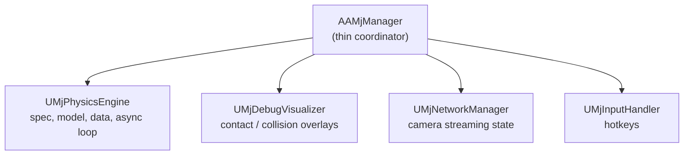
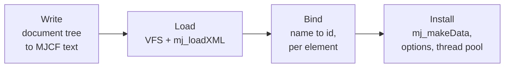
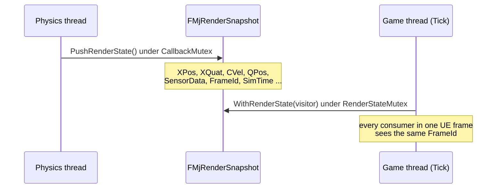

# Architecture

How URLab embeds MuJoCo inside Unreal Engine: the manager and its subsystems, the compile and step pipeline, the physics thread and render-snapshot handoff, and the networking transports that let external clients drive the sim.

This page is about the engine internals. The Python-facing wire frames (msgpack envelope, op names, payload schemas) live in [Protocol Reference](../reference/protocol.md); this page links there for wire details and stays focused on what runs inside the plugin.

## The manager and its subsystems

`AAMjManager` is the top-level coordinator actor. It owns no simulation state of its own. Instead it creates four `UActorComponent` subsystems in its constructor (via `CreateDefaultSubobject`) and delegates to them.



| Subsystem | File | Responsibility |
|---|---|---|
| `UMjPhysicsEngine` | `Source/URLab/Public/MuJoCo/Core/MjPhysicsEngine.h` | Owns `m_spec`, `m_vfs`, `m_model`, `m_data`. Runs the compile pipeline and the async step loop. Exposes step-callback registration. |
| `UMjDebugVisualizer` | `Source/URLab/Public/MuJoCo/Core/MjDebugVisualizer.h` | Captures contact data on the physics thread, renders overlays on the game thread. |
| `UMjNetworkManager` | `Source/URLab/Public/Transport/NetworkManager.h` | Tracks camera registration and the global camera-streaming toggle. |
| `UMjInputHandler` | `Source/URLab/Public/MuJoCo/Input/MjInputHandler.h` | Processes simulation hotkeys and dispatches to the other subsystems. |

Subsystems communicate three ways: step callbacks on `UMjPhysicsEngine` (`RegisterPreStepCallback` / `RegisterPostStepCallback`), sibling lookup via `GetOwner()->FindComponentByClass<T>()`, and direct property access (for example `Manager->PhysicsEngine->Options`). `AAMjManager` keeps no duplicate state; its Blueprint-callable helpers (`SetPaused`, `StepSync`, `ResetSimulation`) forward to `PhysicsEngine`.

## Component model

Every MJCF element type maps to a `UMjComponent` subclass attached to an `AMjArticulation` Blueprint. `UMjComponent` derives from `USceneComponent` and implements `IMjSpecElement`. The component tree mirrors the MJCF body hierarchy.

Two methods drive the lifecycle:

- `RegisterToSpec(wrapper, body)` creates the `mjsElement` during spec construction.
- `Bind(model, data, prefix)` resolves the compiled MuJoCo ID and caches raw pointers into `mjModel` / `mjData` through lightweight View structs (`BodyView`, `GeomView`, `JointView`, and so on, in `MuJoCo/Utils/MjBind.h`).

Imported articulations and user-built articulations both produce the same `UMjComponent` tree and run through the same compile path. See the [Importing guide](../guides/importing.md) and [Articulations guide](../guides/articulations.md) for the authoring side.

## Compile pipeline

Compilation runs once at `BeginPlay` (and again on a recompile request). It is owned by `UMjPhysicsEngine` and proceeds in phases.



1. **Write.** The level is scanned with `GetAllActorsOfClass` and projected into a scene assembly: a root document plus one `<attach>` per participating `AMjArticulation`, `UMjQuickConvertComponent`, and `AMjHeightfieldActor`. Each participant's component tree is serialised to canonical MJCF, and the assets it names are collected as in-memory bytes. Unnamed elements are given reserved names for the duration of the write, so they can be found again afterwards.
2. **Load.** The root text, the participant documents and the asset bytes go into a MuJoCo VFS, and `mj_loadXML` produces `mjModel*`. On failure the diagnostics are returned to the caller and the previous model is left untouched — the compile happens before anything is torn down.
3. **Bind.** Each element is resolved by `mj_name2id` under its participant's prefix and told the id it received, and each articulation's control slots are sized to the scene it compiled into.
4. **Install.** The old model and its `mjData` are freed, `mj_makeData` allocates fresh state, simulation state is migrated onto the new addresses (see below), `ApplyOptions()` writes manager-level overrides into `m_model->opt`, and `ApplyThreadPool()` sizes the per-step worker pool.

### Recompiling a running scene

A recompile is a new `mjModel`, and a new model means new addresses: a joint that gained a sibling no longer sits at the same `qpos` slot. Simulation state therefore follows the *element*, not the address. Before the old model is freed, each element's `qpos`/`qvel`, actuator `ctrl`/`act`, and mocap pose are stashed against the element's creation serial; after `mj_makeData`, they are written back at whatever addresses the new binding gives.

- An element that survived the edit keeps its pose.
- An element that was deleted takes its state with it — the joint that inherits its slot holds its own value.
- An element that was added starts at the model's own `qpos0`.
- An element whose shape changed (a hinge become a ball) starts at the defaults, because there is no meaning to carrying three numbers into a slot that now holds four.
- `time` continues, so a recompile is an edit to a running simulation rather than a new one.

### Compile latency

Measured by `URLab.Perf.CompileLatency`, which prints a `BENCH` line to the run log. The scene is a 30-body, 29-joint, 29-geom robot — the shape of an imported Menagerie arm — averaged over 5 runs after a warm-up.

| Stage | What it covers | Cost |
|---|---|---|
| `write_ms` | document tree to canonical MJCF text | **0.38 ms** |
| `compile_ms` | write, plus VFS staging, `mj_loadXML` and name binding | **3.47 ms** |
| `install_ms` | the whole of `InstallCompiledDocument`: the above, plus joining the physics worker, unbinding, freeing the old model, `mj_makeData`, state migration, rebinding and one step | **4.26 ms** |

**A recompile is fast enough to drive interactively.** A full install of this robot costs 4.3 ms, which fits inside a 60 Hz frame (16.7 ms) with room to spare, so a structural edit during play can be applied on the frame it happens.

Printing MJCF and re-parsing it is not what costs the time. The write is 0.38 ms — under a tenth of the total. What dominates is MuJoCo's own `mj_loadXML`, about 3.1 ms of the 4.3, and that is parsing plus the model compile MuJoCo would have to do whatever route the document reached it by. Everything URLab adds on top of the engine — writing the text, staging the VFS, binding names to ids, tearing the old model down and migrating state — is under 1.2 ms combined. Replacing the text route with a native spec route would therefore save well under a millisecond here.

The cost is per element, so it scales: a scene ten times this size is a recompile of roughly 40 ms, which is past a frame. If that becomes the case worth optimising, `mj_loadXML` is the thing to attack, not the writer.

Run it to get current numbers on your own machine:

```powershell
.\Scripts\build_and_test.ps1 -Engine 'C:\Program Files\Epic Games\UE_5.7' `
                             -Project 'C:\path\to\your.uproject' `
                             -Filter 'URLab.Perf.CompileLatency'
```

!!! note "Debug XML"
    With `bSaveDebugXml` enabled, a successful compile also writes `scene_compiled.xml` and `scene_compiled.mjb` to `Saved/URLab/`. Diff the compiled XML against the source MJCF to spot import or default-inheritance mismatches. See the [Debug guide](../guides/debug.md).

## Simulation options

`<option>` is an ordinary MJCF element, and URLab holds it as one: a `UMjOption`
component with a `UMjFlag` child, generated from the schema. Only attributes the
document actually sets are written, so an unset one keeps whatever MuJoCo decides.
Values are in MJCF's own units and MuJoCo's own frame -- no cm, no Y-flip.

It appears in two places with different scopes:

- `AMjArticulation::SimOption` / `SimFlags` is the `<option>` the articulation was
  imported with. It is applied to that articulation's child spec before
  `mjs_attach()`. It is not the scene's authority: MuJoCo takes the scene's option
  block whole and discards an attached document's own copy.
- `AAMjManager::SceneOption` / `SceneFlags` is the scene's, and it wins. It is
  applied to the compiled model after a successful compile, and it is what the
  `set_sim_options` RPC and the Simulate dashboard write.

Resolution order is therefore: MuJoCo built-in defaults, then the articulation's
own `<option>` into its child spec, then the scene's `<option>` onto the compiled
model.

## Physics thread and render snapshot

Physics runs on a dedicated async thread launched from `RunMujocoAsync()` via `Async(EAsyncExecution::Thread, ...)`. Each iteration runs under `CallbackMutex` (owned by `UMjPhysicsEngine`):

1. Service pending reset / restore (`mj_resetData` or `mj_setState`, then `mj_forward`).
2. Run registered pre-step callbacks (these drain the inbound control SUB and apply external forces).
3. Apply per-articulation controls into `d->ctrl`.
4. Step: `mj_step(m_model, m_data)`, unless paused, or unless a `CustomStepHandler` is bound (used by replay playback and the direct / puppet network modes).
5. Run registered post-step callbacks (debug capture, snapshot fan-out).
6. Push a render snapshot for the game thread.

After releasing the mutex the loop spin-waits (`FPlatformProcess::YieldThread`) until `TargetInterval / SpeedFactor` has elapsed, so `SimSpeedPercent` controls wall-clock pace.

### Per-step thread pool

`UMjPhysicsEngine::NumWorkerThreads` is an `EditAnywhere` / `BlueprintReadWrite` UPROPERTY (default `0`, meaning single-threaded). `ApplyThreadPool()` calls `mju_threadpool` on the live `mjData` to build or free MuJoCo's internal per-step worker pool. The value is clamped to the logical core count (`MaxWorkerThreads()`). `mju_threadpool` is idempotent, so the pool can be resized at edit time or at runtime through the `set_sim_options` RPC.

### Render snapshot pathway

The game thread must never read `mjData` directly while the physics thread is stepping. Instead the physics thread publishes a coherent snapshot.



`FMjRenderSnapshot` (`Source/URLab/Public/MuJoCo/Core/MjRenderSnapshot.h`) is a single-frame copy of body / geom / site / camera / joint / sensor / flex state plus a monotonic `FrameId`. `PushRenderState()` fills it once per step on the physics thread; `WithRenderState()` holds `RenderStateMutex` for the whole visitor body so all UE-side transform updates in a frame observe one coherent physics frame. This is what drives `UMjBody` transform sync and on-demand transform queries without tearing.

## Thread safety

| Mechanism | Owner | Protects |
|---|---|---|
| `CallbackMutex` (`FCriticalSection`) | `UMjPhysicsEngine` | `m_model` / `m_data` during stepping; held by `StepSync` |
| `RenderStateMutex` (`FCriticalSection`) | `UMjPhysicsEngine` | `FMjRenderSnapshot` during push / visit |
| `DebugMutex` (`FCriticalSection`) | `UMjDebugVisualizer` | contact visualization buffer |
| `CameraMutex` (`FCriticalSection`) | `UMjNetworkManager` | active-camera list |
| `bPendingReset` / `bPendingRestore` / `bShouldStopTask` (`std::atomic<bool>`) | `UMjPhysicsEngine` | cross-thread signals |

## Networking and remote stepping

External Python clients drive physics over a wire. The path splits into a transport-agnostic dispatcher (`FURLabRpcDispatcher`, owned by `UURLabBridgeServer`) plus pluggable transports (ZMQ and shared memory), with manager-owned publishers fanning out one render snapshot per physics tick. The three step modes (`live`, `direct`, `puppet`), both transports, the streaming wire rows, and the threading handoff are covered in [Networking](networking.md).

## Coordinate system

MuJoCo uses right-handed Z-up metres; Unreal uses left-handed Z-up centimetres. Every conversion lives in `Source/URLab/Public/MuJoCo/Utils/URLabAxisConv.h`, and nowhere else:

- Position: `X -> X`, `Y -> -Y`, `Z -> Z`; metres x 100 = centimetres.
- Rotation: MuJoCo quaternion `[w, x, y, z]` maps to an `FQuat` with X and Z negated to flip handedness.

The document itself is never converted. An MJCF attribute is stored exactly as authored, in MuJoCo's frame and units, and conversion happens only where a value becomes an Unreal transform: the editor preview, the editor write-back, the runtime render pass and the runtime input path. An authored `quat` is therefore an `FMjQuatRot`, not an `FQuat` -- the two differ by a permutation and a sign flip, and a distinct type is what stops one being handed to a rotation API by mistake. `FMjQuatRot::ToUnreal()` is the crossing.


