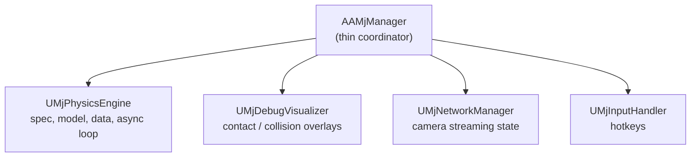
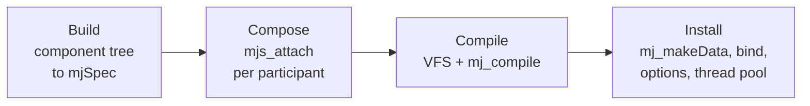
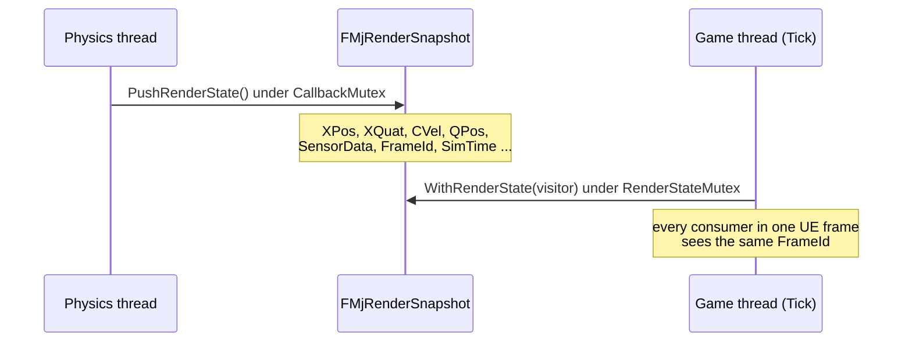

# Architecture

How URLab embeds MuJoCo inside Unreal Engine: the manager and its subsystems, the compile and step pipeline, the physics thread and render-snapshot handoff, and the networking transports that let external clients drive the sim.

This page is about the engine internals. The Python-facing wire frames (msgpack envelope, op names, payload schemas) live in [Protocol Reference](../reference/protocol.md); this page links there for wire details and stays focused on what runs inside the plugin.

## The manager and its subsystems

`AAMjManager` is the top-level coordinator actor. It owns no simulation state of its own. Instead it creates four `UActorComponent` subsystems in its constructor (via `CreateDefaultSubobject`) and delegates to them.



| Subsystem | File | Responsibility |
|---|---|---|
| `UMjPhysicsEngine` | `Source/URLab/Public/MuJoCo/Core/MjPhysicsEngine.h` | Owns the compiled scene (and through it the `mjModel`) plus `m_data`. Runs the compile pipeline and the async step loop. Exposes step-callback registration. |
| `UMjDebugVisualizer` | `Source/URLab/Public/MuJoCo/Core/MjDebugVisualizer.h` | Captures contact data on the physics thread, renders overlays on the game thread. |
| `UMjNetworkManager` | `Source/URLab/Public/Transport/NetworkManager.h` | Tracks camera registration and the global camera-streaming toggle. |
| `UMjInputHandler` | `Source/URLab/Public/MuJoCo/Input/MjInputHandler.h` | Processes simulation hotkeys and dispatches to the other subsystems. |

Subsystems communicate three ways: step callbacks on `UMjPhysicsEngine` (`RegisterPreStepCallback` / `RegisterPostStepCallback`), sibling lookup via `GetOwner()->FindComponentByClass<T>()`, and direct property access (for example `Manager->PhysicsEngine->Options`). `AAMjManager` keeps no duplicate state; its Blueprint-callable helpers (`SetPaused`, `StepSync`, `ResetSimulation`) forward to `PhysicsEngine`.

## Component model

Every MJCF element type maps to a `UMjNodeComponent` subclass, generated from MuJoCo's own schema, and the tree of those components *is* the model. `UMjNodeComponent` derives from `USceneComponent`, so an element takes part in the components panel, undo, duplication and the viewport gizmo like any other component. An `AMjArticulation` holds one such tree in its `Spec` property.

Imported articulations and user-built articulations are the same tree and run through the same compile path. See [The component model](model.md) for how an element maps onto a component, how defaults and references work, and what the compile does to them. The authoring side is in the [Importing guide](../guides/importing.md) and the [Articulations guide](../guides/articulations.md).

## Compile pipeline

Compilation runs once at `BeginPlay` (and again on a recompile request). It is owned by `UMjPhysicsEngine::InstallCompiledSpec` and proceeds in phases.



1. **Build.** The level is scanned and projected into a scene assembly: a scene root plus one participant per `AMjArticulation`, `UMjQuickConvertComponent` and `AMjHeightfieldActor`, each with the prefix its compiled names will carry. Every participant's component tree is walked once into its own `mjSpec` through `mjs_*` calls, and the assets it names are collected as in-memory bytes. Unnamed elements are given reserved names for the duration of the build so that remote clients have something to refer to.
2. **Compose.** Each participant spec is attached into the scene spec with `mjs_attach`, under a frame carrying its placement. A failed attach corrupts the target spec beyond recovery, so the build is abandoned rather than retried.
3. **Compile.** The asset bytes are mounted into a MuJoCo VFS and `mj_compile` produces `mjModel*`. On failure the diagnostics are returned to the caller and the previous model is left untouched — the compile happens before anything is torn down.
4. **Install.** `mj_makeData` allocates fresh state, the old model and its `mjData` are freed, each element is told the id `mjs_getId` gave it, each articulation's control slots are sized to the scene it compiled into, simulation state is migrated onto the new addresses (see below), and `ApplyThreadPool()` sizes the per-step worker pool.

### Recompiling a running scene

A recompile is a new `mjModel`, and a new model means new addresses: a joint that gained a sibling no longer sits at the same `qpos` slot. Simulation state therefore follows the *element*, not the address. Before the old model is freed, each element's `qpos`/`qvel`, actuator `ctrl`/`act`, and mocap pose are stashed against the element's creation serial; after `mj_makeData`, they are written back at whatever addresses the new binding gives.

- An element that survived the edit keeps its pose.
- An element that was deleted takes its state with it — the joint that inherits its slot holds its own value.
- An element that was added starts at the model's own `qpos0`.
- An element whose shape changed (a hinge become a ball) starts at the defaults, because there is no meaning to carrying three numbers into a slot that now holds four.
- `time` continues, so a recompile is an edit to a running simulation rather than a new one.

### Compile latency

Measured by `URLab.Perf.CompileLatency`, which prints a `BENCH` line to the run log. The scene is a 28-body robot, each body carrying a geom and a hinge — the shape of the robots people actually import — averaged over five runs after a warm-up. It asserts no threshold: a perf assertion on a shared machine fails for reasons that have nothing to do with the code, so it reports and the reader judges.

Three numbers, because they answer different questions:

| Stage | What it covers |
|---|---|
| `write_ms` | serializing the spec to MJCF text. Not on the compile route at all: it is what the bridge handshake and the render-farm upload are handed, and the install still pays for it. |
| `compile_ms` | building the scene spec and compiling it. Model in hand, nothing installed. |
| `install_ms` | the whole of `InstallCompiledSpec`: the above, plus the handshake text, joining the physics worker, unbinding, freeing the old model, `mj_makeData`, rebinding every element, sizing control slots, and one step. |

The cost is per element, so it scales with the scene. Run it to get numbers on your own machine:

```powershell
.\Scripts\build_and_test.ps1 -Engine 'C:\Program Files\Epic Games\UE_5.7' `
                             -Project 'C:\path\to\your.uproject' `
                             -Filter 'URLab.Perf.CompileLatency'
```

!!! note "Debug XML"
    With `bSaveDebugXml` enabled, a successful compile also writes `scene_compiled.xml` and `scene_compiled.mjb` to `Saved/URLab/`. Diff the compiled XML against the source MJCF to spot import or default-inheritance mismatches. See the [Debug guide](../guides/debug.md).

## Simulation options

`<option>` is an ordinary MJCF element, and URLab holds it as one: a `UMjOption`
component with a `UMjFlag` child, generated from the schema. Only attributes the
document actually sets are written, so an unset one keeps whatever MuJoCo decides.
Values are in MJCF's own units and MuJoCo's own frame -- no cm, no Y-flip.

The scene's is `AAMjManager::SceneOption` / `SceneFlags`, components of the
manager's own scene spec, and it is what the `set_sim_options` RPC and the
Simulate dashboard write. Live edits from either reach the running model through
`UMjPhysicsEngine::ApplyOptions()`; on a compile the values are simply part of
the scene spec and are compiled in.

An imported articulation can carry an `<option>` of its own, as an ordinary
component in its tree. It is not the scene's authority. When the participant is
attached, MuJoCo's own conflict resolver decides which model-level block
survives, driven by the `conflict` attribute on the scene's `<compiler>`, and
URLab logs a warning naming the participant so the resolution is not silent.
`<size>` is resolved the same way and logged as an info.

## Physics thread and render snapshot

Physics runs on a dedicated async thread launched from `RunMujocoAsync()` via `Async(EAsyncExecution::Thread, ...)`. Each iteration runs under `CallbackMutex` (owned by `UMjPhysicsEngine`):

1. Service pending reset / restore (`mj_resetData` or `mj_setState`, then `mj_forward`).
2. Run registered pre-step callbacks (these drain the inbound control SUB and apply external forces).
3. Apply per-articulation controls into `d->ctrl`.
4. Step: `mj_step(m_model, m_data)`, unless paused, or unless a `CustomStepHandler` is bound (used by replay playback and the direct / puppet network modes).
5. Run registered post-step callbacks (debug capture, snapshot fan-out).
6. Push a render snapshot for the game thread.

After releasing the mutex the loop spin-waits (`FPlatformProcess::YieldThread`) until `TargetInterval / SpeedFactor` has elapsed, so `SimSpeedPercent` controls wall-clock pace.

### Per-step thread pool

`UMjPhysicsEngine::NumWorkerThreads` is an `EditAnywhere` / `BlueprintReadWrite` UPROPERTY (default `0`, meaning single-threaded). `ApplyThreadPool()` calls `mju_threadpool` on the live `mjData` to build or free MuJoCo's internal per-step worker pool. The value is clamped to the logical core count (`MaxWorkerThreads()`). `mju_threadpool` is idempotent, so the pool can be resized at edit time or at runtime through the `set_sim_options` RPC.

### Render snapshot pathway

The game thread must never read `mjData` directly while the physics thread is stepping. Instead the physics thread publishes a coherent snapshot.



`FMjRenderSnapshot` (`Source/URLab/Public/MuJoCo/Core/MjRenderSnapshot.h`) is a single-frame copy of body / geom / site / camera / joint / sensor / flex state plus a monotonic `FrameId`. `PushRenderState()` fills it once per step on the physics thread; `WithRenderState()` holds `RenderStateMutex` for the whole visitor body so all UE-side transform updates in a frame observe one coherent physics frame. This is what drives `UMjBody` transform sync and on-demand transform queries without tearing.

## Thread safety

| Mechanism | Owner | Protects |
|---|---|---|
| `CallbackMutex` (`FCriticalSection`) | `UMjPhysicsEngine` | `m_model` / `m_data` during stepping; held by `StepSync` |
| `RenderStateMutex` (`FCriticalSection`) | `UMjPhysicsEngine` | `FMjRenderSnapshot` during push / visit |
| `DebugMutex` (`FCriticalSection`) | `UMjDebugVisualizer` | contact visualization buffer |
| `CameraMutex` (`FCriticalSection`) | `UMjNetworkManager` | active-camera list |
| `bPendingReset` / `bPendingRestore` / `bShouldStopTask` (`std::atomic<bool>`) | `UMjPhysicsEngine` | cross-thread signals |

## Networking and remote stepping

External Python clients drive physics over a wire. The path splits into a transport-agnostic dispatcher (`FURLabRpcDispatcher`, owned by `UURLabBridgeServer`) plus pluggable transports (ZMQ and shared memory), with manager-owned publishers fanning out one render snapshot per physics tick. The three step modes (`live`, `direct`, `puppet`), both transports, the streaming wire rows, and the threading handoff are covered in [Networking](networking.md).

## Coordinate system

MuJoCo uses right-handed Z-up metres; Unreal uses left-handed Z-up centimetres. Conversions live in two places and nowhere else: `Source/URLab/Public/MuJoCo/Spec/MjFrameTypes.h` for authored values, and `Source/URLab/Public/MuJoCo/Utils/URLabAxisConv.h` for the raw arrays read out of `mjModel` and `mjData`. Both do the same thing:

- Position: `X -> X`, `Y -> -Y`, `Z -> Z`; metres x 100 = centimetres.
- Rotation: MuJoCo quaternion `[w, x, y, z]` maps to an `FQuat` with X and Z negated to flip handedness.

The document itself is never converted. An MJCF attribute is stored exactly as authored, in MuJoCo's frame and units, and conversion happens only where a value becomes an Unreal transform: the editor preview, the editor write-back, the runtime render pass and the runtime input path. An authored `quat` is therefore an `FMjQuatRot`, not an `FQuat` -- the two differ by a permutation and a sign flip, and a distinct type is what stops one being handed to a rotation API by mistake. `FMjQuatRot::ToUnreal()` is the crossing.


