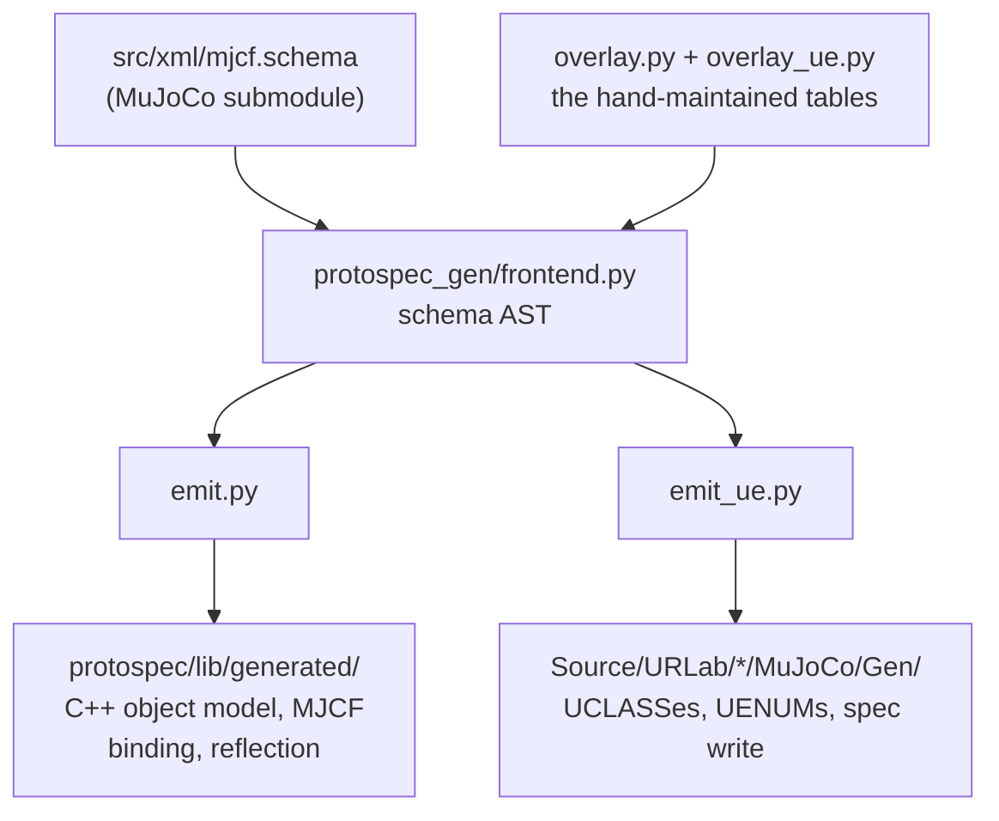

# Generation

URLab does not hand-write its MuJoCo model layer. MuJoCo declares the
whole MJCF grammar in one schema file, and the plugin's element
components, their properties, their enums, and the code that writes them
into a MuJoCo spec are all emitted from it.

This page is about what is generated and what keeps it honest. For the
commands, see [Regenerating the profile](../contributing/generation.md).
For what the generated components then do, see
[The component model](model.md).

## Why the model layer is generated

MJCF is a large format. Every element has to appear as an editable
Unreal component, every attribute as a property, every attribute has to
survive a round trip through the MJCF reader and writer, and every one
has to reach the right field of the right `mjs*` struct. That surface
moves with each MuJoCo release.

The failure mode is what makes hand-mirroring a bad trade. A missed
attribute is not a compile error. It is a model that loads, simulates,
and behaves differently from the same file in MuJoCo, with nothing to
point at.

MuJoCo already declares all of it, once, in
`third_party/MuJoCo/src/src/xml/mjcf.schema`, and parses that file with
its own `doc/generate/mjcf_schema.py`. URLab reads the same declaration
with the same parser, straight out of the submodule working tree. A
MuJoCo bump moves the grammar and the plugin regenerates against it.

## From schema to components

The library that does this is ProtoSpec, in the plugin's `protospec/`
directory. One front end reads the schema; two emitters consume the
result.



`frontend.py` imports MuJoCo's own schema parser rather than vendoring a
copy, then applies the overlay and produces a plain AST. Everything
downstream reads that AST and never the schema file.

`emit.py` writes ProtoSpec's own C++ object model into
`protospec/lib/generated/`. That is what the MJCF reader and writer are
built on, and it has no Unreal in it at all.

`emit_ue.py` writes URLab's half into `Source/URLab/Public/MuJoCo/Gen/`
and `Source/URLab/Private/MuJoCo/Gen/`. Both trees are checked in.

## What the Unreal emitter writes

144 element headers under `Public/MuJoCo/Gen/Elements/`, filed by family
(`Bodies/`, `Joints/`, `Geometry/`, `Actuators/`, `Sensors/`, `Assets/`,
and so on), plus the tables that make them usable:

| File | Holds |
|---|---|
| `Elements/Mj<El>.gen.h` | one `UCLASS` per schema element: its `UPROPERTY`s and the Get / Set / Has / Clear accessor quartet per attribute |
| `MjEnums.gen.h` | one `UENUM` per schema enum, 48 of them |
| `MjKeywords.gen.h` | enum to MJCF keyword, both directions |
| `MjElements.gen.h` | the umbrella include |
| `MjVisit.gen.h` | the per-element field hook the reader, writer and SDK walk |
| `MjStorage.gen.h` | the string and array-shape policies over Unreal storage |
| `MjDefaults.gen.h` | the schema's own `=` defaults |
| `MjDispatch.gen.h` | class to element type, child storage slots, tag recovery |
| `MjReflect.gen.h` | presence and clear thunks over `TOptional` |
| `MjSpecWrite.gen.h` | which `mjs_*` call creates each element and which field each attribute lands in |
| `MjProfile.gen.h` | the generated half of the ProtoSpec profile tag |

A generated element header is ordinary Unreal code. This is `<body>`:

```cpp
UCLASS(ClassGroup = (MuJoCo))
class URLAB_API UMjBodyBase : public UMjNodeComponent
{
    GENERATED_BODY()

public:
    UPROPERTY(EditAnywhere, Category = "MuJoCo", meta = (ToolTip = "..."))
    TOptional<FMjPosition3> Pos;

    UFUNCTION(BlueprintPure, Category = "MuJoCo")
    bool HasPos() const { return Pos.IsSet(); }
    ...
};
```

The tooltips are MuJoCo's own reference manual. Each attribute is bound
to an anchor in the submodule's `doc/XMLreference.rst`, recorded in
`protospec/protospec_gen/doc_anchors.json`, so hovering a property in
the details panel shows what the MuJoCo docs say about the MJCF
attribute it writes.

## Generated versus hand-written code

There are no marker-fenced regions and no partially generated files.
Every file under `MuJoCo/Gen/` is generated whole and is never edited by
hand. Hand-written code sits outside that tree and reaches it through
three seams.

**The seam header.** `Source/URLab/Public/MuJoCo/Spec/MjGenHooks.h`
aliases the ten entry points that scale with the schema: the per-element
field visit, the class-to-element-type conversions both ways, node
dispatch, the child-slot queries, the storage policies, the profile tag,
and the schema defaults. Hand code outside `Gen/` never names a concrete
generated element type, so a rename on the generated side is one edit.

**Hand subclasses.** Six elements need per-instance state that Unreal's
reflection has to see, such as a render target or a mesh component
reference: body, camera, geom, mesh, texture, flexcomp. For those the
generator emits `UMj<El>Base` and a hand class derives from it and
registers itself. It is still the same element; reading, writing,
dispatch and binding cannot tell the difference.

**Write hooks.** Some MJCF attributes MuJoCo's reader *interprets*
rather than stores. `fromto` folds into pos, quat and a size slot; an
actuator's transmission target is elected from several attributes
together; equality operands are elected the same way. There is no
`mjs_set*` for any of that, so `MjSpecWriteHooks.cpp` reproduces the
rule MuJoCo's own reader applies and cites the upstream source location
it mirrors. The emitter refuses to emit a write it cannot justify, so an
attribute that stops having a plain field is a generation error naming
the attribute rather than a silently dropped value.

Everything else that is hand-written is not schema-shaped at all: the
build walk, scene composition, the asset sink, the editor UI, the
physics engine.

## The overlay is the only hand-maintained table

The schema says what MJCF declares. It does not say everything URLab
needs to know. Two files carry the difference:

- `protospec/protospec_gen/overlay.py` is the grammar half. What an
  attribute means, which children of a section share one ordered list,
  which attributes are angles, which strings are references.
- `protospec/protospec_gen/overlay_ue.py` is the Unreal half. Which
  reflected type each spatial attribute stores in, which properties sit
  behind the Advanced disclosure, which folder an element header lands
  in, and which `mjs_*` call creates each element.

The split is deliberate: a ProtoSpec build without Unreal ignores the
second file entirely.

The Unreal half is where the frame types come from. The schema types
`pos`, `axis`, `rgb1` and `diaginertia` all as `double[3]`, and they are
not one thing to Unreal: crossing into Unreal space negates Y and scales
by 100 for a point, negates Y alone for a direction, and does nothing at
all for a colour or an inertia. So each kind gets its own reflected type
(`FMjPosition3`, `FMjDirection3`, `FMjVec3`) and the wrong conversion
stops being expressible. The conversions live once, in
`MuJoCo/Spec/MjFrameTypes.h`.

## The drift gates

Generated code is checked in, which means it can disagree with the
schema. Several gates exist so that it cannot do so quietly.

**The byte gate.** `emit --check` and `regen_ue_profile -Check`
regenerate in memory and fail on any byte difference against what is
committed. `Scripts/build_and_test.ps1` runs the Unreal one before
invoking UBT, printing `>>> Profile drift gate: regen_ue_profile.ps1
-Check`, and exits 4 on drift.

**Removal gates.** An overlay entry naming an element, enum, keyword or
attribute the schema no longer declares fails generation by name. So
does a `reading=custom` or `writing=custom` facet the overlay neither
binds to a handler nor waives with a stated reason.

**Addition gates.** The removal gates all read the overlay and ask the
schema about it, which leaves upstream free to add something the overlay
has never heard of. Three additions would land silently wrong, so each
has its own gate:

| Addition | What it would do | Gate |
|---|---|---|
| a repeatable child of an interleaved section left out of its `INTERLEAVE` row | becomes a separate list, shifting every id in that family | strict, no waiver |
| a new angle-valued attribute not in `ANGLE_ATTRS` | read as radians whatever the document says, wrong by 57.3x | heuristic, waivable in `NOT_ANGLE` |
| a new dynamic reference not in `TARGET_FROM` | a plain string no referrer scan or rename fixup can see | heuristic, waivable in `NOT_TARGET` |

The two heuristic gates fire only on attributes that are new, which is
computed against `protospec/protospec_gen/classified_attrs.json`.

**Documentation gates.** A restructured MuJoCo manual fails generation
naming the attribute and the anchor that moved, because the alternative
is the editor quietly describing an attribute from an anchor that now
documents something else.

**Coverage.** `emit_ue.py` also writes an automation test,
`Source/URLabEditor/Private/Tests/MjGenCoverage.gen.cpp`, so the schema
checks itself against the compiled plugin rather than only against the
committed text.

## What the gates cannot check

Gates compare tables. Three things are checked by running models
instead.

**Live compile parity** compiles every fixture in
`Content/TestData/parity/` two ways, once through the component tree and
once through `mj_loadXML` of the same authored file, and field-diffs the
two `mjModel`s at zero tolerance. Nothing is recorded, so it cannot
bless a regression. This is what keeps the write hooks honest.

**The corpus net** (`protospec/corpus_net.ps1`, `corpus_net.sh`)
round-trips every model in MuJoCo's own corpus through the MJCF reader
and writer, loads the result with `mj_loadXML`, and field-diffs that
against a stock load of the original. It has a declared allowed-failure
list which is currently empty, and a floor on how many models must have
round-tripped identically so that a run which silently skipped its
subject fails rather than passing empty. `build_and_test` does not run
it.

**Compiled-model goldens** in `Content/TestData/goldens/` pin output
across changes that are not supposed to move it.

## What a MuJoCo version bump involves

Moving the submodule and regenerating, then answering what the gates
say. In outline:

1. Move `third_party/MuJoCo/src` and stage the gitlink.
2. Rebuild the third-party install, then ProtoSpec.
3. Run `emit --check` and `Scripts/regen_ue_profile.*`, and answer every
   gate by editing an overlay table rather than by loosening the gate.
4. Re-read the upstream citations in the write hooks. Nothing checks
   that a citation still describes the code it names.
5. Build, run the suite, run the corpus net, recapture the goldens.

Step 3 is the part the tooling does for you: each failure names the
exact overlay entry to edit. Step 4 is the part it cannot, and it is the
step most likely to be skipped. The full procedure, with the checklist,
is in [Bumping MuJoCo](../contributing/bumping_mujoco.md).

## When the generated layer is absent

`protospec/build.ps1` and `build.sh` stage ProtoSpec into
`third_party/install/protospec/`. When that directory is missing,
`URLab.Build.cs` defines `URLAB_PROTOSPEC=0`, `MjGenHooks.h` sets
`URLAB_MJ_GEN` to 0, and everything depending on generated types
compiles out. The build then **succeeds**, with one line in a long log:

```
URLab: ProtoSpec is not installed under third_party/install/protospec -
building without the generated MuJoCo spec profile.
```

A green build is therefore not evidence the pipeline is present. The
absence of that line, plus the presence of the directory, is the check.

## Related

- [The component model](model.md): what the generated components are and
  how they become a simulation.
- [Regenerating the profile](../contributing/generation.md): the
  commands and the rules for editing.
- [Bumping MuJoCo](../contributing/bumping_mujoco.md): the full
  version-bump procedure.
- [MJCF Support](mjcf_support.md): the coverage this pipeline produces.
