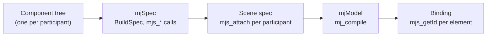

# The Component Model

An Unreal Blueprint holds a tree of components. In URLab that tree **is**
the MuJoCo model. There is no MJCF document behind it, no mirrored
object graph, and no translation layer that could fall out of step with
what you edited.

This page covers what a component is, how an MJCF element maps onto one,
how defaults and references work, and what happens when the model is
compiled. For where the component classes come from, see
[Generation](generation.md).

## There is no second document

Every element of a MuJoCo model is a `UMjNodeComponent`, and an
articulation's `Spec` property is the root of that tree:

```cpp
/**
 * This articulation's MuJoCo spec, as the component tree it is.
 *
 * There is no second artifact: what the importer read, what the details
 * panel edits and what the writer emits are all this tree.
 */
UPROPERTY(VisibleAnywhere, BlueprintReadOnly, Category = "MuJoCo|Spec")
TObjectPtr<UMjModel> Spec;
```

`UMjNodeComponent` derives from `USceneComponent`, so an element is an
ordinary Unreal component: it appears in the components panel, it takes
part in undo and duplication, it is saved with the Blueprint, and the
viewport gizmo moves it.

`Source/URLab/Public/MuJoCo/Spec/MjNodeComponent.h` is the whole of the
non-schema base. It carries the authored name, identity, spec order,
provenance, the compiled-model id, and the transform write-back that
keeps the gizmo and the authored pose the same fact. Nothing on it
scales with the schema.

## An MJCF element is a component

One `UCLASS` per schema element, named after the MJCF tag, with the
`<mujoco>` root as `UMjModel`:

| MJCF | Component | Where |
|---|---|---|
| `<mujoco>` | `UMjModel` | `Gen/Elements/MjModel.gen.h` |
| `<body>` | `UMjBody` | `Gen/Elements/Bodies/`, hand subclass |
| `<geom>` | `UMjGeom` | `Gen/Elements/Geometry/`, hand subclass |
| `<site>` | `UMjSite` | `Gen/Elements/Geometry/` |
| `<joint>`, `<freejoint>` | `UMjJoint`, `UMjFreeJoint` | `Gen/Elements/Joints/` |
| `<motor>`, `<position>`, `<general>` … | `UMjMotor`, `UMjPosition`, `UMjActuatorGeneral` | `Gen/Elements/Actuators/` |
| `<touch>`, `<gyro>`, `<framepos>` … | `UMjTouch`, `UMjGyro`, `UMjFramepos` | `Gen/Elements/Sensors/` |
| `<mesh>`, `<material>`, `<texture>` | `UMjMesh`, `UMjMaterial`, `UMjTexture` | `Gen/Elements/Assets/` |
| `<default>` | `UMjDefault` | `Gen/Elements/Defaults/` |
| `<option>`, `<compiler>`, `<flag>` | `UMjOption`, `UMjCompiler`, `UMjFlag` | `Gen/Elements/Options/` |

A handful are disambiguated where one tag means two things: `<joint>`
under `<equality>` is `UMjEqualityJoint`, `<plugin>` under `<actuator>`
is `UMjActuatorPlugin`, `<contact>` as a sensor is `UMjSensorContact`.

Structural MJCF tags that are not elements do not become components.
`<worldbody>` is the clearest case: it is the tag a `<body>` child of
`<mujoco>` is written under, so the world body is a `UMjBody` sitting
directly under the `UMjModel` root, and the robot's bodies nest inside
it. The same is true of the section tags `<asset>`, `<actuator>`,
`<sensor>` and `<contact>`. An actuator component is a child of the root,
not of an actuators folder.

**Declaration order is semantic.** Joint order under a body determines
the qpos layout, so it cannot rest on Unreal's attachment list, which is
transient and rebuilt from registration order at load. Spec order is
persisted in `UMjNodeComponent::SiblingIndex`, stamped at creation and
renumbered on insert and remove. A component added by hand in the
components panel arrives unstamped and orders *after* every stamped
sibling, so adding a joint appends rather than silently rewriting the
robot's qpos layout.

## Attributes are optional properties

An MJCF attribute is a `UPROPERTY`, and almost all of them are wrapped:

```cpp
UPROPERTY(EditAnywhere, Category = "MuJoCo", meta = (ToolTip = "..."))
TOptional<FMjPosition3> Pos;
```

The wrapper is the point. MJCF distinguishes "this attribute was not
written" from "this attribute was written with the value that happens to
be the default", and those two mean different things: an unwritten
attribute falls through to the default class chain, a written one does
not. A plain `double` would collapse the distinction.

`TOptional` has no Blueprint pin, so every attribute also gets an
accessor quartet: `HasPos()`, `GetPos()`, `SetPos()`, `ClearPos()`.
`GetPos()` falls back to the schema default; it does not resolve the
default-class chain.

In the details panel, each optional property carries a checkbox that sets
or clears it. Unset rows show the value that would be inherited, greyed,
labelled with where it comes from (`(from arm_class)` or `(default)`),
next to a **Set** button that authors it onto the element. Reading is
effective; writing stays authored-only, so previewing an inherited value
never authors it.

Values are stored exactly as MJCF spells them, in MuJoCo's own frame and
units. The type says which conversion is legal when a value crosses into
Unreal space: `FMjPosition3` flips Y and scales by 100, `FMjDirection3`
flips Y alone, `FMjVec3` and `FLinearColor` do nothing, `FMjQuatRot`
holds the MJCF quaternion verbatim as `[w, x, y, z]`. Handing one to a
rotation API by mistake does not compile.

## Defaults and inheritance

A `<default>` class is a `UMjDefault` component, and its class name is
the component's own name. The template values inside it are ordinary
element components parented under it: an `MjGeom` under an `MjDefault`
is that class's `<geom>` partial, not a geom in the scene.

Nothing marks a component as a template. The question is answered by
position, because that is what MJCF says: a partial *is* a child of the
`<default>` carrying the class, and `<default>` nests.

Membership is two string properties, both offered as dropdowns:
`Dclass` (MJCF `class`) on the element itself, and `Childclass` (MJCF
`childclass`) on a body or frame, which propagates to everything beneath
it.

Resolution order is the compiler's: the element's own authored value,
then its class chain from nearest to furthest, then MuJoCo's own schema
value. `Source/URLab/Public/MuJoCo/Spec/MjEffective.h` walks those layers
and hands back the storage rather than a merged copy, because the editor
preview asks this question on every registration.

## References are names

A reference from one element to another is a name string, because that is
what MJCF is. A geom's `Material`, an actuator's transmission target and
a sensor's `Objname` are all `FString` or `TOptional<FString>`
properties, and MuJoCo resolves them at compile time.

Storing them as plain strings would make them invisible, so the generated
field walk hands every reference over wrapped in
`urlab::RefView<Target, Slot>` (`MuJoCo/Spec/MjRefView.h`). The phantom
`Target` parameter names the namespace the reference points into, and the
wrapper is what the reference machinery matches on. Three things depend
on it:

- **Dropdowns.** A reference property offers the names of the right kind
  of element in the same spec, rather than a free-text box.
- **Rename safety.** Renaming an element rewrites every referrer, in the
  same transaction, filtered by target namespace so a body and a geom
  that share a name do not cross-rename.
- **Dangling reports.** A reference naming nothing is recorded on the
  element that carries it, in `DanglingReferences`, at the moment it
  becomes bad rather than at the moment somebody presses play.

The element also records `PlacementProblems`, because MJCF says which
elements may contain which, and a component parented against that is not
an error you would otherwise be told about: the element is simply absent
from the compiled model, and the model still compiles.

## What happens on compile

The tree is walked once into an `mjSpec`, MuJoCo's own in-memory model
description, and MuJoCo compiles that into an `mjModel`. No MJCF text is
involved.



**Build.** `BuildSpec` (`MuJoCo/Spec/MjSpecBuild.cpp`) walks one
participant's tree and creates each element with the `mjs_add*` call the
schema binds it to: `mjs_addBody`, `mjs_addGeom`, `mjs_addJoint`,
`mjs_addSensor`, `mjs_addDefault`, and so on. Attributes are written into
the `mjs*` struct field by field, guarded on presence, so an unauthored
attribute is never written and inherits exactly as it would have under
MuJoCo's own reader.

Sections are written in a fixed phase order rather than document order:
defaults, model-level blocks, assets, bodies, contacts, deformables,
equalities, tendons, actuators, sensors, custom, keyframes, extensions.
A geom naming a material has to find that material already on the spec,
because MuJoCo resolves material references and default classes by name
at compile time.

**Compose.** Each participant is attached into the scene spec under a
frame carrying its placement, with `mjs_attach` and the participant's
name prefix. A failed attach corrupts the target spec beyond recovery,
so the whole build is abandoned rather than retried.

**Compile.** Assets are mounted into an `mjVFS` as in-memory bytes and
`mj_compile` produces the `mjModel`.

**Bind.** The build records a map from component to `mjsElement*` while
it walks. After the compile, `mjs_getId` turns each of those handles into
the compiled id, and `mjsElement::elemtype` gives the object family.
Nothing is looked up by name, so nothing depends on a component having
one. The component itself stores only the resulting `int32`, never a
pointer, so no pointer into a spec can outlive the spec through a
component.

Elements the compiler removed report nothing and stay as authoring data.
`discardvisual` and `fusestatic` both remove some, and an id into a table
that does not hold the element is worse than no id at all.

## Where MJCF text still exists

Two boundaries, and nowhere else.

**The file boundary.** Import reads MJCF into components; export writes
components back out. The handshake writer serializes the assembled scene
to MJCF for external clients, after the compile and not as its input.

**The macro bridge.** A few MJCF constructs are not elements but
compile-time macros: `<replicate>`, `<composite>`, `<flexcomp>`. MuJoCo
expands them during its own read, not through the spec API, and there is
no `mjs_addReplicate`. For those, and only those, the build serializes
the macro's subtree back to MJCF, parses it with MuJoCo's reader, and
attaches the expansion. It is scoped to the macro's subtree.

## Related

- [Generation](generation.md): where the element classes come from.
- [Architecture](architecture.md): what happens to the compiled model,
  the physics thread and the transports.
- [Articulations](../guides/articulations.md): editing the tree.
- [MJCF Support](mjcf_support.md): what round-trips.
