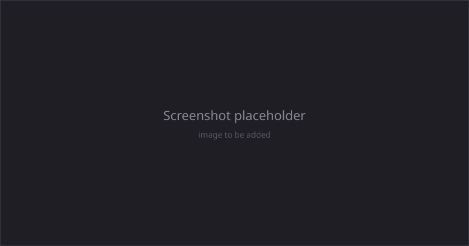

# Articulations

An articulation is a MuJoCo model expressed as an Unreal Blueprint. This guide covers editing one in the Blueprint editor, building one from scratch, and driving it from Blueprint or C++ at runtime.

An `AMjArticulation` holds a tree of MuJoCo components. That tree *is* the MuJoCo model, not a mirror of one: when the level is simulated, URLab walks it into a MuJoCo spec and compiles it. See [The component model](../concepts/model.md) for the mechanics.



## The component tree

The tree is the MJCF document, element for element. `MjModel` is the `<mujoco>` root, and the world body is an `MjBody` directly under it:

```
Spec (MjModel)
├── worldbody (MjBody)
│   └── body1 (MjBody)
│       ├── Geom_Box (MjGeom, Type = box)
│       ├── HingeJoint (MjJoint, Type = hinge)
│       └── body2 (MjBody) ...
├── shoulder_motor (MjMotor)
├── fingertip_touch (MjTouch)
└── arm_class (MjDefault)
```

The component's variable name in the tree becomes the MuJoCo element name, so name your components clearly.

Section tags such as `<asset>`, `<actuator>` and `<sensor>` are not components. An actuator is a child of the root, and the writer puts it under the right section tag on its way out.

## Building from scratch

1. Right-click in the Content Browser, choose **Blueprint Class**, and select `MjArticulation`. Open it.
2. **Add bodies.** In the Components panel, **Add** an `MjBody` as a child of the world body, set its transform, and nest bodies to form kinematic chains (for example upper arm, forearm, hand).
3. **Add geoms.** Select a body and add an `MjGeom`, then pick its **Type**: box, sphere, capsule, cylinder, ellipsoid, plane, mesh, hfield or sdf. Size the primitives with the transform gizmo. See [Geometry & Collision](geometry.md).
4. **Add joints.** Select a body and add an `MjJoint`, then pick its **Type**: hinge, slide or ball. A free joint is its own element, `MjFreeJoint`. Configure axis, limits, stiffness, and damping in the Details panel.
5. **Add actuators and sensors.** Each MJCF spelling is its own component: `MjMotor`, `MjPosition`, `MjVelocity`, `MjActuatorGeneral` and so on for actuators, `MjTouch`, `MjGyro`, `MjJointpos` and so on for sensors. Set the reference property the element declares (a joint, a site, a tendon) to pick what it drives or measures.

A component parented somewhere MJCF does not allow is not silently dropped. The element records why in `PlacementProblems`, visible on the component, and moving it somewhere legal clears it.

## Reading the Details panel

Every property on a MuJoCo component is generated from MJCF's own schema, so the
panel is laid out the way the schema is.

- **Categories.** Everything sits under **MuJoCo**, then the element:
  `MuJoCo > Geom`, `MuJoCo > Joint`. Where MJCF itself groups attributes —
  an actuator's transmission, a sensor's common settings — the panel adds that
  group as a sub-category.
- **Advanced.** Solver parameters (`solref`, `solimp`, `margin`, `gap`), the
  `user` payload and rendering hints sit behind the **Advanced** disclosure
  arrow at the bottom of a category. They are ordinary editable properties;
  they are just not the ones you reach for first.
- **Tooltips.** Hovering a property shows the schema's own description of the
  attribute and the MJCF name it writes, so you can match a property to the
  MJCF you would have written by hand.
- **Unset versus set.** Most properties are optional. An unset property is not
  written to MJCF at all, which lets the value fall through to a default class
  or to MuJoCo's own default. Use the checkbox beside a property to set or
  clear it.

!!! warning "Multi-selecting components whose optionals differ"

    Select several components at once and a property that is **set on some and
    unset on others** does not show a value editor. In its place Unreal shows a
    three-item dropdown: *Multiple States*, *Set all to Value*, *Set all to
    None*.

    While the selection is mixed there is no way to edit the underlying value,
    and no way to edit only some of the selected components. Pick one of the two
    "Set all" entries to bring the selection into agreement, and the normal
    editor comes back.

    This is Unreal's own optional-property widget, not something URLab
    configures. Selecting components whose properties are all set, or all unset,
    is unaffected.

## Cross-references use dropdowns

Most references between components are dropdown pickers, not typed strings. An actuator's **Target** lists the joints, tendons, sites, or bodies valid for its transmission type; a sensor's **Target** lists the objects valid for its type; contact pairs pick two geoms; equalities pick two objects. The dropdowns read and write the underlying string properties that the MuJoCo spec uses.

## Working with defaults

Default classes hold shared properties (friction, damping, and so on) that many components inherit.

1. Add an `MjDefault`. Its variable name becomes the MuJoCo class name.
2. Add child components under it to define template values (for example an `MjGeom` child to set default friction). A component under an `MjDefault` is a class template, not scene content: MuJoCo never places it and the viewport never draws it.
3. Nest defaults to build inheritance chains: drag one default under another in the tree.
4. On a body or frame, set **Childclass** to assign a class to everything beneath it. On an individual element, set **Dclass** (MJCF `class`) to name one class. Both are dropdowns over the classes in the same spec.

## Compiling and validating

Most problems are reported on the element that has them, as you make them, rather than at compile time. A reference naming nothing lands in **Dangling References**, a component parented somewhere MJCF does not allow lands in **Placement Problems**, and a geom whose shape has nothing to draw lands in **Preview Problems**. All three are on the component, under `MuJoCo|Diagnostics`, and all three clear themselves when the cause goes away.

Errors only MuJoCo's own compiler can find (an invalid range, an inconsistent inertia) arrive when the scene is compiled, in the Output Log.

For a filtered view of large articulations, open **Window, MuJoCo Outliner**. It lets you pick which open articulation to inspect, filter by component type, search by name, and click an entry to select it in the Blueprint tree.

## Controlling at runtime

An articulation is a normal actor. Get a reference however you like (Get All Actors of Class, a cast from a hit, a stored variable), or look it up through the Manager.

```cpp
AAMjManager* Manager = AAMjManager::GetManager();
AMjArticulation* Robot = Manager->GetArticulation("MyRobot");
```

Its MuJoCo components are child components. Fetch them by name or as arrays with `GetActuator`, `GetJoint`, `GetSensor` (and the plural `GetActuators` / `GetJoints` / `GetSensors`). All of these are Blueprint-callable.

**Drive actuators:**

```cpp
Robot->SetActuatorControl("shoulder", 1.57f);
FVector2D Range = Robot->GetActuatorRange("shoulder"); // (min, max)
```

In Blueprint, wire **Get Game Time in Seconds** through **Sin** into **Set Actuator Control** on Event Tick for a simple sine sweep, and use **Get Actuator Range** to clamp.

**Read sensors:**

```cpp
float Touch = Robot->GetSensorScalar("fingertip_touch"); // 1D sensors
TArray<float> Force = Robot->GetSensorReading("wrist_force"); // vector sensors
float Angle = Robot->GetJointAngle("elbow");
```

Use `GetSensorScalar` for scalar sensors (touch, joint position, clock) and `GetSensorReading` for vector sensors (force, accelerometer). See [Sensors & Cameras](sensors_cameras.md) for what each category returns.

**React to collisions.** `AMjArticulation` exposes an **On Collision** event with `SelfGeom`, `OtherGeom`, and `ContactPos`. In Blueprint, assign a handler; in C++, bind to `Robot->OnCollision`.

## Keyframes

An articulation can hold named keyframe poses. From Blueprint or C++ you can teleport to one, hold it, or list them:

- `ResetToKeyframe(Name)` snaps qpos, qvel, and ctrl to the named keyframe.
- `HoldKeyframe(Name)` continuously maintains a pose; `StopHoldKeyframe()` releases it.
- `GetKeyframeNames()` lists the keyframes on this articulation, and `IsHoldingKeyframe()` reports whether one is held.

The [Simulate Dashboard](dashboard.md) exposes these as a keyframe dropdown with Reset and Hold/Stop buttons. For sequenced multi-pose playback with blending, see the keyframe controller in [Controllers](controllers.md).

## Choosing the control source

Each articulation has a `ControlSource` (`0` = ZMQ, `1` = UI) that overrides the Manager-level default. This lets some robots run from the dashboard sliders while others take external commands in the same scene.

Set it on the articulation in Details, or globally through the physics engine:

```cpp
Manager->PhysicsEngine->SetControlSource(EControlSource::ZMQ);
```

!!! note
    The global control source lives on the physics engine, reached as `Manager->PhysicsEngine`, not on the Manager directly. See [Controllers](controllers.md) for how the control pipeline uses this value.

For low-level access, every component exposes its compiled MuJoCo ID, prefixed name, and bound status, which you can use to index into `mjData` directly. Most workflows do not need this.
