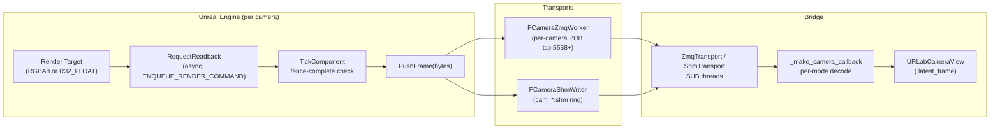

# Camera Capture Modes

Every `UMjCamera` has a `CaptureMode` property that decides what the render target contains. One mode per camera — spawn multiple cameras if you need multiple streams (RGB + depth + masks) from the same viewpoint.

| Mode | Output | Render target | Wire dtype | Bridge frame shape |
|---|---|---|---|---|
| `Real` (default) | Photoreal RGB. Matches viewport, respects post-process. | `RTF_RGBA8_SRGB` | `bgra8` (4 bytes/px) | `(H, W, 4)` uint8 RGBA |
| `Depth` | Linear scene depth in centimetres. | `RTF_R32f` | `float32` (4 bytes/px) | `(H, W)` float32 |
| `SemanticSegmentation` | Per-actor-class color tint. | `RTF_RGBA8` | `bgra8` (4 bytes/px) | `(H, W, 4)` uint8 BGRA |
| `InstanceSegmentation` | Per-body unique color tint. | `RTF_RGBA8` | `bgra8` (4 bytes/px) | `(H, W, 4)` uint8 BGRA |

All four modes share the same 4-byte-per-pixel wire stride, so the SHM and ZMQ paths transport them identically — the consumer interprets the bytes per the camera's advertised mode.

## End-to-end flow



## Configuring a camera

Set `CaptureMode` on a `UMjCamera` component in the Details panel. For `Depth`, also set `DepthNearCm` (default 10 cm) and `DepthFarCm` (default 10000 cm) — the UE simulate widget uses these for grayscale normalization.

`CaptureMode` is read at `SetStreamingEnabled(true)` time. To change mode on a running camera, toggle streaming off and on:

```cpp
Cam->SetStreamingEnabled(false);
Cam->CaptureMode = EMjCameraMode::Depth;
Cam->SetStreamingEnabled(true);
```

A future PR adds runtime mode/resolution swap via a bridge RPC that pauses publishers, rebuilds the render target + SHM region, and resumes — see `docs/plan_camera_intrinsics.md`.

## Coexistence — multiple modes in one frame

Seg modes work without swapping materials on the real meshes, so an RGB camera and a seg camera can stream simultaneously in the same frame with no contamination either way.

Under the hood, `UMjDebugVisualizer` maintains a refcounted **sibling-mesh pool** per seg mode. The first seg camera that streams triggers the pool build; additional cameras on the same mode share it; the pool is torn down when the last subscriber unsubscribes.

- Sibling components duplicate every articulation visual mesh and every Quick-Convert static mesh with an unlit tint MID.
- They are `bVisibleInSceneCaptureOnly = true` and also disable reflection captures, sky captures, ray-tracing contribution, distance-field lighting, and dynamic indirect lighting — secondary lighting passes can't leak a faint tinge into the main viewport.
- Seg cameras use `PrimitiveRenderMode = PRM_UseShowOnlyList` to render only their pool.
- Non-seg URLab cameras (`Real`, `Depth`) refresh their `HiddenComponents` against the live pools each tick so a late-starting seg camera never contaminates a running RGB or depth stream.

Cost: up to 3 components per body while both seg pools are active (original + instance sibling + semantic sibling). Each view still draws N primitives — per-view draw count is unchanged. Pools are lazy, so RGB-only sessions pay zero.

## Streaming over the wire

```mermaid
sequenceDiagram
    autonumber
    participant Cam as UMjCamera
    participant Trans as ZMQ / SHM publisher
    participant Sub as Bridge SUB thread
    participant View as URLabCameraView

    loop per camera capture
        Cam->>Cam: SceneCapture render → RT
        Cam->>Cam: ENQUEUE_RENDER_COMMAND readback
        Note right of Cam: TArray&lt;FColor&gt; for BGRA modes,<br/>TArray&lt;FLinearColor&gt; .R for Depth
        Cam->>Cam: ReadbackFence completes
        Cam->>Trans: PushFrame(bytes)
        Trans-->>Sub: framed payload (4 bytes/px)
        Sub->>Sub: per-mode decode (BGRA→RGBA / float32 reshape)
        Sub->>View: latest_frame = ndarray
    end
```

### ZMQ broadcast

Each camera owns its own PUB socket (default `tcp://*:5558+`). Topic is `<articulation>/camera/<name>` (e.g. `g1/camera/head_rgbd`). Frame body is the raw 4-bytes-per-pixel payload.

`bEnableZmqBroadcast` works for **all four modes** — the worker drains a `TQueue<TArray<FColor>>` for color modes and a `TQueue<TArray<float>>` for depth, sending whichever has data.

### SHM broadcast

`bEnableShmBroadcast` opens a per-camera SHM region at `<ProjectSavedDir>/URLabShm/<session>/cam_<prefix>_<name>.shm`. Same double-buffer + sequence-fence pattern as the state-stream publisher. The slot stride is sized for `width * height * 4` bytes plus the size prefix — works for BGRA8 and float32 single-channel alike.

The bridge `ShmTransport` opens these files lazily and falls back to the ZMQ camera stream for any camera whose SHM region never appears.

## Reading frames in Python

```python
from urlab_client import URLabClient, CameraMode

client = URLabClient(step_mode="live")
client.discover()

art = client.articulations["g1"]
view = art.cameras["head_rgbd"]

for _ in range(1000):
    client.step(n_steps=1)
    frame = view.latest_frame
    if frame is None:
        continue
    if view.mode == CameraMode.DEPTH:
        # frame: (H, W) float32 in centimetres
        assert frame.dtype.name == "float32"
        depth_m = frame / 100.0
    elif view.mode == CameraMode.REAL:
        # frame: (H, W, 4) uint8 RGBA
        rgb = frame[..., :3]
    else:
        # SemanticSegmentation / InstanceSegmentation:
        # frame: (H, W, 4) uint8 BGRA, color tint encodes the class / instance id.
        b, g, r, a = frame[..., 0], frame[..., 1], frame[..., 2], frame[..., 3]
```

For stepped (synchronous) capture, request specific cameras in the step call:

```python
reply = client.step(
    n_steps=10,
    include_cameras={"head_rgbd": "sync", "wrist_rgb": "latest"},
)
for name, cam in reply["cameras"].items():
    print(name, cam["dtype"], cam["width"], cam["height"], len(cam["data"]))
    # head_rgbd float32 848 480 1626880
    # wrist_rgb bgra8   640 480 1228800
```

`"sync"` blocks the step until UE has captured a fresh frame; `"latest"` returns whatever's already cached. In `live` mode, both downgrade to "latest" — UE is running autonomously and the bridge can't time a frame grab to the snapshot.

## Debug UI

The bridge ships a `dearpygui`-based dashboard launched via `urlab-ui`; the camera tab lives at `urlab_dashboard/tabs/cameras.py`. After connecting it auto-discovers every camera in the handshake, creates a per-camera dynamic texture at native resolution, and blits live frames into the layout each render tick. Per-mode decode is the same as the snippet above:

- Real: BGRA→RGBA, normalised to floats for dpg.
- Depth: 5/95 percentile normalisation, replicated across RGB for visualisation. (A future PR will use `near_cm` / `far_cm` from the camera's intrinsics block — see `docs/plan_camera_intrinsics.md`.)
- Seg: BGRA→RGBA so the seg colors render correctly in the UI; the raw `latest_frame` stays BGRA for downstream class-id mapping.

## Simulate widget preview (UE side)

The simulate widget's camera panel shows every `UMjCamera` on the selected articulation, each rendering its configured mode live. No extra setup — the feed entry inspects `CaptureMode` and picks the right display path:

- `Real` / `SemanticSegmentation` / `InstanceSegmentation` — the render target binds directly as the slate brush resource.
- `Depth` — an R32f RT can't be a slate brush. The entry CPU-copies the R channel each tick into a BGRA `UTexture2D`, mapping `depth ∈ [DepthNearCm, DepthFarCm]` to grayscale, and binds that texture instead.

The depth preview path is synchronous (`ReadLinearColorPixels` flushes rendering commands). Fine for debug UI; if you need headless depth capture at full framerate, use the Python bridge.

## Known v1 limitations

- **Seg tints are lit-shaded, not flat.** Seg cameras use `SCS_FinalToneCurveHDR` because `BasicShapeMaterial`'s `Color` parameter isn't wired directly to the BaseColor G-buffer. Scene lighting therefore modulates the tint. Good enough for visual debugging; not pixel-exact for ground-truth segmentation masks. The cleanest fix is a plugin-shipped unlit parent material — on the roadmap.
- **Mode changes mid-PIE require toggling streaming off/on.** The render target format is mode-specific (`RTF_RGBA8` vs `RTF_R32f`) and live reconfiguration requires a coordinated pause / rebuild / resume — planned in the camera-intrinsics PR series.
- **Runtime articulation spawn.** The sibling pool is built on first seg subscriber. Articulations or Quick-Convert props that spawn *after* a seg camera is already streaming won't appear in its output until the pool is rebuilt (toggle that seg camera's streaming off/on to force a rebuild).
- **Third-party `USceneCaptureComponent2D`.** User-authored scene captures outside URLab's management won't automatically hide siblings — they'll see them as regular primitives (since siblings are `bVisibleInSceneCaptureOnly = true`, they *are* visible to scene captures by definition). Add the sibling pool to that component's `HiddenComponents` manually if this is a problem.
- **No camera intrinsics on the wire yet.** `near_cm` / `far_cm` / `fx` / `fy` / `cx` / `cy` / distortion will land in a follow-up PR — see `docs/plan_camera_intrinsics.md`. Bridge currently uses adaptive percentile normalisation for depth display; ROS rebroadcasters will need to fall back to `fovy` + resolution.

## Implementation references

- Mode enum + per-camera state — [MjCameraTypes.h](../../Source/URLab/Public/MuJoCo/Components/Sensors/MjCameraTypes.h), [MjCamera.h](../../Source/URLab/Public/MuJoCo/Components/Sensors/MjCamera.h)
- Per-mode render target + scene-capture setup — [MjCamera.cpp::SetupRenderTarget](../../Source/URLab/Private/MuJoCo/Components/Sensors/MjCamera.cpp)
- Float-readback path for Depth — [MjCamera.cpp::RequestReadback](../../Source/URLab/Private/MuJoCo/Components/Sensors/MjCamera.cpp)
- ZMQ camera worker — [MjCamera.cpp::FCameraZmqWorker](../../Source/URLab/Private/MuJoCo/Components/Sensors/MjCamera.cpp)
- SHM camera writer — [CameraShmWriter.cpp](../../Source/URLab/Private/MuJoCo/Components/Sensors/CameraShmWriter.cpp)
- Pool lifecycle — [MjDebugVisualizer.cpp::AcquireSegPool](../../Source/URLab/Private/MuJoCo/Core/MjDebugVisualizer.cpp)
- Depth preview (UE simulate widget) — [MjCameraFeedEntry.cpp::UpdateDepthPreview](../../Source/URLab/Private/UI/MjCameraFeedEntry.cpp)
- Bridge consumer — `URLabClient._make_camera_callback` in `urlab_bridge/src/urlab_client/client.py`
- Automation coverage — `URLab.Camera.*` in [MjCameraTests.cpp](../../Source/URLabEditor/Private/Tests/MjCameraTests.cpp)
