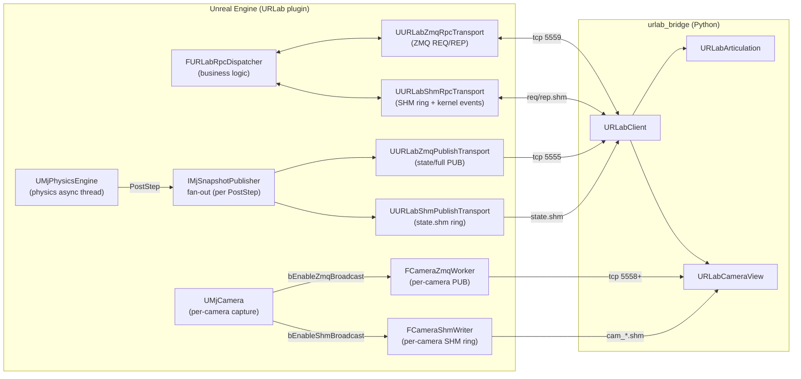
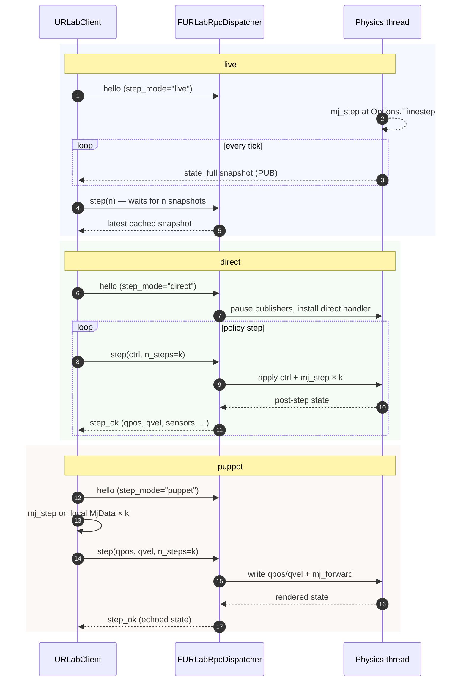
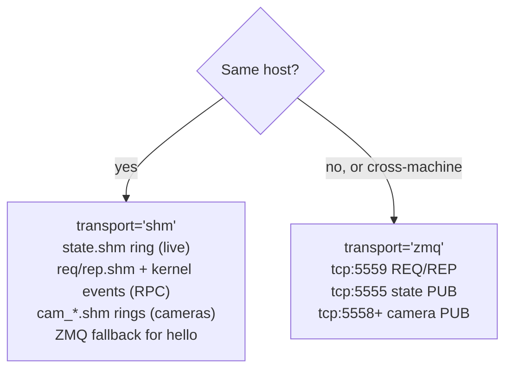

# Networking

UE-side architecture for the bridge: how a Python client drives URLab
over a wire protocol. Two transports (ZMQ over TCP, shared-memory ring
buffers on the same host) and three step modes (`live`, `direct`,
`puppet`) are available.

This page covers the UE-internal pieces — dispatcher, publishers,
transport plumbing, performance. **Python-side usage is in
[Python Getting Started](../python/getting_started.md) and
[Python API Reference](../python/api.md).** The
[Step Server Protocol](../reference/step_server.md) documents the wire
frames.

## Architecture at a glance



- **`FURLabRpcDispatcher`** owns the runtime business logic (handshake,
  step, reset, set_mode, recording / replay, configure_controller, plus
  the runtime mutators `set_qpos` / `set_mocap_pose` / `get_contacts`).
  It's transport-agnostic and lives on `UURLabBridgeServer`, which
  survives PIE transitions.
- **Editor-only namespaces** (`scene.*`, `sim.*` for PIE lifecycle,
  `outliner.*`, `debug.*`, `viewport.*`) register with the same op
  registry but are served from the `URLabEditor` module so they're
  unavailable in shipping builds. They share the wire envelope and
  msgpack encoding — see [Python API Reference](../python/api.md) for
  the per-namespace method list.
- **RPC transports** (`UURLabZmqRpcTransport`, `UURLabShmRpcTransport`)
  move msgpack bytes between the wire and `Dispatcher::Dispatch()`.
  Both can be active simultaneously; clients pick which to talk to at
  construction.
- **State snapshots** are built **once per physics tick** by
  `AAMjManager` and fanned out to every registered
  `IMjSnapshotPublisher` (ZMQ PUB, SHM ring). No double-build.
- **`URLabClient`** is the Python entry point. After `discover()`,
  articulations and cameras are accessible as plain Python objects.

## Step modes

URLab advances physics in one of three modes per session. Pick on the
Python side via `URLabClient(step_mode=...)`; see
[Pick a step mode](../python/getting_started.md#pick-a-step-mode) for
the user-facing version.



| Workflow | Mode |
|---|---|
| Teleop, ROS 2 bridge, dashboards | `live` |
| Deterministic scripted control, data collection, UE owns the integrator | `direct` |
| Thin clients in languages without a MuJoCo binding | `direct` |
| MJX / `mujoco_warp` / Jax rollouts (you own the integrator) | `puppet` |
| Not sure | `auto` (auto-promotes to `direct` on first hello) |

**Rule of thumb:**

- Want UE to integrate? → `direct`
- Already integrated locally, want URLab to render the state? → `puppet`
- Want a dashboard while a human teleops? → `live`

## Switching modes mid-session

When `AMjManager.StepMode == Auto`, the client can flip modes at runtime
via `client.runtime.set_mode(...)`. If the project pinned `StepMode` to
a specific value, the RPC fails with `error(code="mode_locked_by_server")`.
Direct↔puppet transitions should be followed by `client.reset()` if
state cleanliness matters: `d->ctrl` may carry stale values from direct,
and `d->qvel` may disagree with the client's local copy if puppet
reconnects to a running sim. See
[`set_mode` in the wire protocol](../reference/step_server.md#set_mode)
for the on-wire details.

## Transports



- **ZMQ (default)** — TCP REQ/REP for RPC + PUB/SUB for state and
  cameras. Works cross-host, uses ports 5555 (state PUB) / 5559 (RPC) /
  5558+ (per-camera PUB). Median round-trip ~600-700 µs on loopback.
- **SHM** — same-host shared-memory ring buffers with Windows
  kernel-event signalling. Lower jitter than ZMQ, especially for camera
  streams. Hello, large RPCs, and out-of-bounds payloads automatically
  fall back to ZMQ. Median round-trip ~600 µs, p99 tighter.

The SHM transport pulls its session directory from the handshake
(`shm_session_dir`), so the bridge doesn't need to know UE's
`<ProjectSavedDir>` layout. See
[Pick a transport](../python/getting_started.md#pick-a-transport) for
the user-facing recommendation.

## Performance ballpark

Numbers from `scripts/bench_transports.py` on Windows 11, single-machine
loopback, G1 29-DoF, observation level "standard":

| Transport | Mode | mean | p50 | p99 | steps/s |
|---|---|---:|---:|---:|---:|
| zmq | direct | 2000 µs | 1992 µs | 2396 µs | 500 |
| zmq | puppet | 747 µs | 720 µs | 1196 µs | 1337 |
| zmq | live | 670 µs | 636 µs | 1252 µs | 1493 |
| shm | direct | 2001 µs | 1992 µs | 2406 µs | 500 |
| shm | puppet | 647 µs | 634 µs | 966 µs | 1545 |
| shm | live | 596 µs | 569 µs | 1273 µs | 1678 |

Direct mode at 500 Hz is dominated by `mj_step` itself (sim_decimation
rolls in proportionally). SHM wins on tail latency for puppet and live.
Camera streaming benefits more from SHM than RPC does — there are no
measurements here yet but per-frame jitter drops noticeably.

## Cameras

Each `UMjCamera` runs two independent broadcast paths, each gated by
its own UPROPERTY:

- `bEnableZmqBroadcast` — pushes frames via `FCameraZmqWorker` to a
  per-camera ZMQ PUB on `tcp:5558+`.
- `bEnableShmBroadcast` — pushes frames via `FCameraShmWriter` to a
  per-camera SHM ring at `cam_<prefix>_<name>.shm`.

Both can be enabled simultaneously, and both fire from the same
PostStep callback inside `UMjCamera`. This is *not* the same path as
the state snapshot — there's no `IMjSnapshotPublisher` involvement;
each camera owns its own workers.

The Python side surfaces them as `URLabCameraView` under `art.cameras`
(articulation-local) or `client.global_cameras` (unowned), reading
from whichever transport the bridge was constructed with. For the
consumer-side API, capture timing, and frame layouts see
[Camera Capture Modes](camera_capture_modes.md) and the
[Cameras section](../python/api.md#cameras) of the Python API.

## Streaming wire format (PUB/SUB)

The continuous PUB/SUB streams the bridge consumes in `live` mode are
also the channel the ROS 2 bridge (and any other cross-language
consumer) talks to. This section is the wire reference for code that
sits outside `urlab_bridge`.

### Plugin-side components

Three components handle streaming, auto-created on `AAMjManager` at
BeginPlay if none exist:

| Component | Socket | Default endpoint | Purpose |
|---|---|---|---|
| `UURLabZmqPublishTransport` | PUB | `tcp://*:5555` | Joint state, sensor data, twist, actions |
| `UURLabZmqSubscribeTransport` | SUB + PUB | `tcp://*:5556` (SUB), `tcp://*:5557` (info PUB) | Control vectors + gain updates inbound; actuator-info JSON outbound |
| `UMjCamera` (ZMQ mode) | PUB | `tcp://*:5558+` | Per-camera frame stream |

UE-side sockets `bind()`. External clients `connect()`.

### Topics — outbound (sensor / state)

Multipart: topic string + binary payload. Topics are
`{ArticPrefix}/{suffix}`.

| Topic | Payload | Source |
|---|---|---|
| `{Name}/joint/{JointName}` | `int32 id, float pos, float vel, float acc` (16 bytes) | `UMjJoint::BuildBinaryPayload` |
| `{Name}/sensor/{SensorName}` | `int32 id, float[] values` (4 + 4·dim bytes) | `UMjSensor::BuildBinaryPayload` |
| `{Name}/base_state/{JointName}` | `7 × float64` (pos xyz + quat wxyz, 56 bytes) | `UMjFreeJoint::BuildBinaryPayload` |
| `{Name}/twist` | `3 × float32` (vx, vy, yaw_rate) | TwistController |
| `{Name}/actions` | `int32` bitmask, only sent when non-zero | TwistController |

### Topics — inbound (control / gains)

`UURLabZmqSubscribeTransport` filters on `{Name}/control ` and
`{Name}/set_gains ` (trailing space disambiguates from other topics
that would otherwise prefix-match).

| Topic | Payload |
|---|---|
| `{Name}/control` | `int32 count`, then `count × (int32 actuator_id, float value)` |
| `{Name}/set_gains` | JSON: `{"joint_name": {"kp": float, "kv": float, "torque_limit": float}, ...}` |

### Info broadcast (port 5557)

Periodic JSON discovery message with actuator names, IDs, ranges, and
camera endpoints. Frequent at startup (every 50 steps for the first
five seconds), then every 500 steps.

### Multi-articulation filtering

Subscribe with the articulation-name prefix:

```python
sub.setsockopt_string(zmq.SUBSCRIBE, "Robot_A/")
```

### ROS 2 bridge

`urlab_tools/ros2_broadcaster/broadcaster.py` in the bridge repo
translates the legacy streams to ROS 2 topics. Run:

```bash
source /opt/ros/humble/setup.bash
uv run python -m urlab_tools.ros2_broadcaster
```

Endpoints default to `tcp://127.0.0.1:5555` (state SUB), `:5556`
(control PUB), `:5558` (camera SUB). Edit `URLabBridge.__init__` in
`broadcaster.py` for non-default endpoints.

#### What it does

A single ROS 2 node (`urlab_ros2_bridge`) polls the ZMQ sockets every
1 ms (non-blocking) and translates each binary frame to a ROS 2
message. Articulations are **auto-discovered**: the first time a
joint/sensor topic with a new prefix arrives, the bridge spins up
both publishers (state outbound) and a subscriber (control inbound)
for that prefix.

| ZMQ source (URLab → bridge) | ROS 2 destination |
|---|---|
| `{prefix}/joint/{name}` — `<Ifff>` (id, pos, vel, acc) | `/{prefix}/joint_states` (`sensor_msgs/JointState`, one joint per message) |
| `{prefix}/sensor/{name}` — `<II + Nf>` (id, dim, values) | `/{prefix}/sensor/{name}` (`std_msgs/Float64MultiArray`) |
| `{prefix}/camera/{name}` — raw BGRA bytes | `/{prefix}/camera/{name}/image_raw` (`sensor_msgs/Image`, BGRA → BGR) |

Inbound (ROS 2 → URLab):

| ROS 2 source | ZMQ destination |
|---|---|
| `/{prefix}/control` (`std_msgs/Float64MultiArray`) | `{prefix}/control ` (binary control packet on `tcp://127.0.0.1:5556`) |

#### Current limitations (worth flagging if you depend on this)

- **JointState `effort` field carries acceleration**, not torque —
  it's the third float in the wire payload. Downstream consumers
  reading `effort` get accel, not torque.
- **Control mapping uses array index as actuator id.** The ROS
  `Float64MultiArray` is sent verbatim with `(index, value)` pairs.
  An actuator-name → id resolution layer using the 5557 info
  broadcast is not yet wired up; that's the right place to fix this
  when needed.
- **Camera resolution is hardcoded to 640 × 480.** Frames that don't
  match that exact byte count get silently dropped. Encode resolution
  in the wire payload (or pass it via the 5557 info channel) to lift
  this.
- **All robots share one node** (`urlab_ros2_bridge`). Multi-robot is
  prefix-routed but not multi-node; if you want per-robot isolation,
  spawn the bridge multiple times with different ROS namespaces.

The implementation is a single ~200-line file at
`src/urlab_tools/ros2_broadcaster/broadcaster.py`. If you need a
shape it doesn't cover, fork rather than special-case — the bridge
is intentionally thin.

### Control source gate

`EControlSource` on each articulation (and globally on the manager)
determines whether actuators read from the ZMQ control SUB or from the
UI. If your client's control writes have no effect, check this is set
to `ZMQ`.

## Further reading

- [Step Server Protocol](../reference/step_server.md): authoritative
  wire reference.
- [Camera Capture Modes](camera_capture_modes.md): per-mode capture,
  streaming, bridge consumer side.
- [Controllers and Gains](../python/controllers_and_gains.md): PD config,
  decimation, runtime updates.
- [Entities](../python/entities.md): non-articulation dynamic objects.
- [Recording and Replay](../python/recording_replay.md): episode capture
  lifecycle.
- [Python Getting Started](../python/getting_started.md): the full
  Python walkthrough.
- [Python API Reference](../python/api.md): `URLabClient` surface,
  typed return objects, transports.
- [Policy Registry](../python/policy_registry.md): bundled pretrained policies and
  adding new ones.
- [Gym Environment](../python/gym_environment.md): `URLabEnv(gym.Env)` adapter for
  users integrating with external training pipelines.
