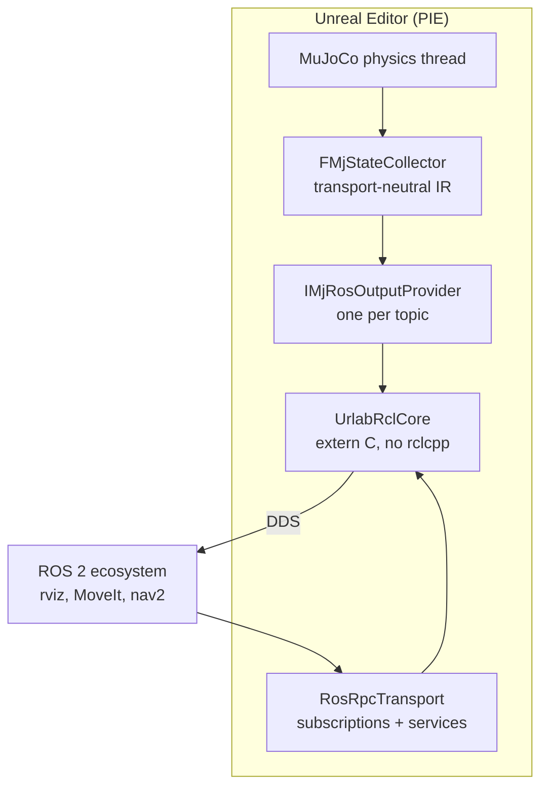

# ROS 2 Integration

URLab publishes robot state and scene geometry as standard ROS 2 messages so
downstream tools (rviz, MoveIt, nav2, your own nodes) consume them without any
shim. It also subscribes: control input, twist commands and joint commands
arrive on ROS topics, with a claim/release service pair deciding who owns an
articulation.

ROS 2 is **optional and modular**. The core plugin has no ROS dependency;
nothing breaks when ROS is absent. The ROS pieces live in a separate `URLabRos`
module that compiles to a no-op when ROS 2 is not installed.

The integration works on **Ubuntu 22.04 / 24.04** (apt or Pixi/Conda) and
**Windows 11** (Pixi/Conda via RoboStack). This guide covers Ubuntu; for Windows
setup see [ROS Workspace Setup](../ros_workspace_setup.md).

---

## 1. Install ROS 2

**Pinned distribution: ROS 2 Lyrical Luth** (LTS, supported to 2031).

=== "Ubuntu 24.04 (apt)"

    ```bash
    sudo apt update
    sudo apt install -y ros-lyrical-ros-base ros-dev-tools
    ```

    Installs into `/opt/ros/lyrical`. `ros-lyrical-ros-base` is enough; the
    `ros-dev-tools` package gives you `ros2` CLI for verification.

=== "Ubuntu 22.04 / 24.04 (Pixi)"

    Pixi is useful when you want an isolated ROS install that doesn't touch the
    system, or when you're on 22.04 (apt doesn't ship Lyrical for 22.04).

    ```bash
    curl -fsSL https://pixi.sh/install.sh | sh
    # restart your shell, then:
    pixi init urlab_ros2_env -c https://prefix.dev/robostack-lyrical -c conda-forge
    cd urlab_ros2_env
    pixi add ros-lyrical-desktop
    ```

    Activate with `pixi shell` from the `urlab_ros2_env` directory whenever you
    build or launch the editor.

---

## 2. Build URLab with ROS enabled

### 2.1 Prerequisites

Build the plugin's native dependencies first (MuJoCo, CoACD, libzmq). See
[Installation](../installation.md) for the full flow. From the plugin root:

```bash
cd third_party
./build_all.sh --engine "$UE_ROOT"
```

### 2.2 Set the ROS root

The `URLabRos` module's build logic probes the `URLAB_ROS2_ROOT` environment
variable. Point it at your ROS install prefix (the directory that holds
`include/`, `lib/`, and `bin/` subdirectories):

=== "apt"

    ```bash
    export URLAB_ROS2_ROOT=/opt/ros/lyrical
    ```

=== "Pixi"

    ```bash
    export URLAB_ROS2_ROOT=$CONDA_PREFIX
    ```

With the variable unset, the build falls back to
`<plugin>/third_party/install/ros2` before giving up. If neither exists the
module builds without ROS (`URLAB_WITH_ROS2=0`) and prints a notice:

```
URLabRos: ROS 2 not found (set URLAB_ROS2_ROOT to enable) - building without ROS.
```

### 2.3 Build

```bash
./Scripts/build_and_test_linux.sh \
    --engine "$UE_ROOT" \
    --project /path/to/YourProject.uproject
```

UBT links a named, pinned set of C libraries (`rcl`, `rcutils`, `rmw`,
`rosidl_runtime_c`, and the generator plus typesupport pair for each message
package it uses) and stages the transitive DDS cluster next to the plugin
binary. Nothing is globbed, so a library that stops being installed fails the
build by name.

### 2.4 Runtime library path

UE does not auto-stage `RuntimeDependencies` for editor builds on Linux, so the
ROS `.so` files must be reachable by the dynamic linker:

```bash
export LD_LIBRARY_PATH="$URLAB_ROS2_ROOT/lib:$LD_LIBRARY_PATH"
./UnrealEditor YourProject.uproject
```

!!! warning "`setup_runtime_linux.sh` does not cover ROS"
    `Scripts/setup_runtime_linux.sh` symlinks the MuJoCo, CoACD and libzmq
    libraries into `Binaries/Linux/`. It does not touch ROS, so it is not an
    alternative to `LD_LIBRARY_PATH` here.

---

## 3. Verify it works

### 3.1 Check module load

Launch the editor and look for the ROS context log line in the output:

```
LogURLabRos: ROS 2 context up (distro <name>, node 'urlab').
```

If you see this, the module loaded and connected to DDS. A warning instead means
the libraries were found but `rcl_init` failed (usually a DDS configuration
issue):

```
LogURLabRos: Warning: ROS 2 unavailable: rcl context init failed (…). ROS publishing is disabled.
```

If you see no `LogURLabRos` lines at all, the module didn't load. Check that the
ROS `.so` files are on `LD_LIBRARY_PATH` and that `URLAB_ROS2_ROOT` was set
during the build.

### 3.2 Start PIE and check topics

With the editor open, enter Play-In-Editor (PIE) with a level that contains an
`MjManager` and at least one robot articulation. In another terminal (with ROS 2
sourced), run:

```bash
ros2 topic list
```

`<art>` below is the articulation's actor name.

**Scene and time**

| Topic | Message type | Rate |
|---|---|---|
| `/clock` | `rosgraph_msgs/Clock` | every sim step |
| `/tf` | `tf2_msgs/TFMessage` | 50 Hz, `world` to `<art>/<body>` |
| `/tf_static` | `tf2_msgs/TFMessage` | latched, the REP-105 chain `map` to `odom` to `world` |
| `/planning_scene` | `moveit_msgs/PlanningScene` | 10 Hz, frame `world`, one scene for the whole level |
| `/urlab/obstacle_cloud` | `sensor_msgs/PointCloud2` | 10 Hz, sampled world geometry |
| `/map` | `nav_msgs/OccupancyGrid` | latched, republished when the scene structure changes |
| `/octomap_binary` | `octomap_msgs/Octomap` | 5 Hz |

**Per articulation**

| Topic | Message type | Rate |
|---|---|---|
| `/<art>/joint_states` | `sensor_msgs/JointState` | 50 Hz |
| `/<art>/pose` | `geometry_msgs/PoseWithCovarianceStamped` | every step, frame `map`, free-base articulations only |
| `/<art>/odom` | `nav_msgs/Odometry` | 50 Hz, frame `odom`, child `<art>/<base>` |
| `/<art>/imu` | `sensor_msgs/Imu` | 100 Hz, one per IMU sensor |
| `/<art>/cmd_twist` | `geometry_msgs/TwistStamped` | the articulation's current twist, as an output |
| `/<art>/robot_description` | `std_msgs/String` | latched URDF, published once |

Note that the URDF is per articulation. There is no bare `/robot_description`.

**Sensors** are routed by what they measure rather than lumped onto one topic:

| Topic | Message type | For |
|---|---|---|
| `/<art>/<name>/wrench` | `geometry_msgs/WrenchStamped` | force and torque sensors |
| `/<art>/<name>/range` | `sensor_msgs/Range` | rangefinders |
| `/<art>/<name>/magnetic_field` | `sensor_msgs/MagneticField` | magnetometers |
| `/<art>/<name>/velocity` | `geometry_msgs/TwistStamped` | velocimeters |
| `/<art>/sensors/<name>` | `std_msgs/Float64MultiArray` | everything else |

**Cameras** publish one pair per streaming camera, under the camera's canonical
name:

| Topic | Message type | Notes |
|---|---|---|
| `/<art>/<cam>/image` | `sensor_msgs/Image` | encoding `bgra8`, or `32FC1` for a depth camera |
| `/<art>/<cam>/camera_info` | `sensor_msgs/CameraInfo` | |

The `bgra8` encoding is worth knowing: it is Unreal's own channel order, and a
consumer assuming RGB will show swapped colours.

**User channels** are the extension point. A channel declared in the level is
published on `/<art>/user/<channel>` or `/urlab/user/<channel>`, with the
message type following the channel kind: `std_msgs/Bool`, `std_msgs/Float64`,
`geometry_msgs/Vector3`, `geometry_msgs/PoseStamped`,
`std_msgs/Float64MultiArray`, or `std_msgs/String` carrying JSON for a struct
channel.

### 3.3 Control input

URLab subscribes as well as publishes. Per articulation:

| Topic | Message type | Effect |
|---|---|---|
| `/<art>/cmd_ctrl` | `std_msgs/Float64MultiArray` | raw actuator controls |
| `/<art>/cmd_vel` | `geometry_msgs/Twist` | twist command |
| `/<art>/joint_command` | `sensor_msgs/JointState` | per-joint targets |
| `/<art>/user/<channel>` | per channel kind | user-channel input |

Two services decide who is driving, both `std_srvs/Trigger`:

```bash
ros2 service call /panda/claim_control std_srvs/srv/Trigger
ros2 service call /panda/release_control std_srvs/srv/Trigger
```

### 3.4 Visualise in rviz

```bash
ros2 run rviz2 rviz2
```

Add a `RobotModel` display, set the description topic to
`/<art>/robot_description`, and add a `TF` display. The robot appears in rviz
with live joint state, driven by MuJoCo physics running inside Unreal.

---

## 4. MoveIt planning

`ros/urlab_moveit/` is a source tree rather than an ament package: there is no
`package.xml`, so it is launched by path rather than by package name.

```bash
ros2 launch ros/urlab_moveit/launch/franka_moveit.launch.py \
    urdf:=/path/to/franka/model.urdf
```

`urdf:=` is mandatory. The launch file reads the URDF from disk rather than from
`/robot_description`, brings up `move_group` with the SRDF committed at
`config/franka.srdf`, runs its own `robot_state_publisher` fed from
`/<art>/joint_states`, and anchors the bare URDF link names under `world` with a
static transform.

Execution goes through `scripts/trajectory_bridge.py`, which converts
`FollowJointTrajectory` goals into `/<art>/joint_command` messages, so no
ros2_control stack is needed on the simulation side. Everything runs on sim time
from `/clock`, so trajectory timing matches a simulation that is not running in
real time.

The SRDF is committed, not generated at launch. `scripts/generate_srdf.py`
regenerates it, taking the disabled collision pairs from real MuJoCo collision
sampling rather than an approximate mesh check:

```bash
uv run python ros/urlab_moveit/scripts/generate_srdf.py \
    --xml /path/to/panda.xml --out ros/urlab_moveit/config/franka.srdf --samples 20000
```

`ros/urlab_jog/` is a sibling tree with a jog-slider launch file for the same
robot.

---

## 5. How it fits together



State flows from MuJoCo through a transport-neutral typed IR,
`FMjStateCollector` (`Source/URLab/Public/State/MjStateCollector.h`), which lives
in the core plugin and not in the ROS module. The ZMQ and shared-memory
transports consume the same snapshot. Each ROS provider reads it and publishes
one topic. The whole ROS side lives in `Source/URLabRos/` and links only the rcl
C API, with no `rclcpp`, no `ament`, and no colcon.

The bridge (ZMQ and shared memory) is always available. ROS is an additional,
independent transport that publishes the same state in ROS-native formats.

---

## 6. Architecture notes

**No rclcpp.** The plugin links the rcl C API directly through a thin
`extern "C"` seam (`Source/URLabRos/Private/Ros/UrlabRclCore.h`). This avoids
the rclcpp dependency, and its `libstdc++` ABI mismatch with UE's bundled
`libc++`, and keeps link times small. `ros/urlab_ros_ws/` is a standalone CMake
harness that exercises that seam against real DDS outside Unreal.

**Self-registering providers.** Every published topic comes from a class that
implements `IMjRosOutputProvider` and registers itself with the
`REGISTER_MJ_ROS_OUTPUT_PROVIDER` macro at module load. `RosPublishTransport`
instantiates them on first publish and again whenever the scene structure
changes, driving `Build` once per rebuild and `Publish` per step. A registration
that reuses an existing provider's name replaces it, so a built-in topic can be
overridden without editing the module.

**Cameras are not providers.** Image publishing runs off `FMjCameraFrameBus` on
the game thread through a per-camera sink, because a camera frame arrives when
the render completes rather than when a physics step ends.

**Graceful degradation.** When `URLAB_WITH_ROS2=0` (no ROS at build time) or
when `FURLabRosContext::Initialize()` fails at runtime (no DDS, bad config),
every ROS code path is fenced and degrades to a no-op. The simulation, bridge,
and dashboard continue normally.

---

## 7. Troubleshooting

**"ROS 2 not found" during build.**
`URLAB_ROS2_ROOT` is unset or points at a missing directory, and
`third_party/install/ros2` is absent too. Export it and re-build. If the ROS
install uses a different layout, point `URLAB_ROS2_ROOT` at the directory that
directly contains `include/`, `lib/`, and `bin/`.

**Editor fails to load with "lib&lt;name&gt;.so: cannot open shared object file".**
The ROS `.so` cluster is not on the linker's search path. Set
`LD_LIBRARY_PATH` to your ROS `lib/` directory before launching the editor.

**Module loads but no topics appear.**
The ROS context failed to initialise. Look for the `rcl context init failed`
warning in the editor log. This usually means DDS discovery cannot start; check
that no firewall is blocking UDP multicast and that `$ROS_DOMAIN_ID` is
consistent across terminals.

**`ros2 topic list` shows topics but rviz sees no TF.**
Wait a few seconds after PIE starts. The TF provider throttles to 50 Hz and
needs at least one sim step before the first message goes out. Also check that
`/tf_static` appears; some tools need it before they render anything.

**Camera images look colour-swapped.**
The image encoding is `bgra8`. Convert rather than assuming RGB.

**Wrong message types or missing fields.**
URLab is pinned to ROS 2 Lyrical. If you sourced a different distro (Humble,
Jazzy, Kilted), message definitions may differ. Run `ros2 topic info <topic>` to
check the type.
